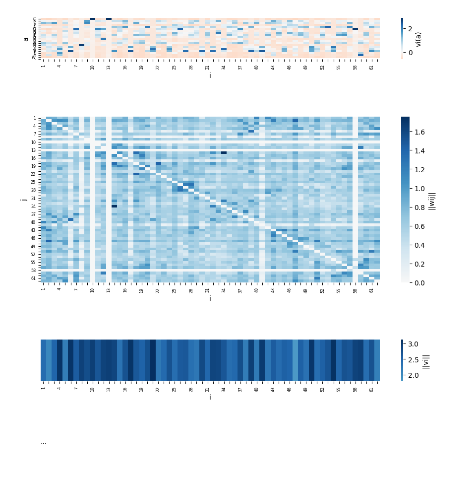

# profileDCA

This package contains the following tools :

* *profileDCA_build* builds a profileDCA model from a sequence or a MSA (output is a folder which also contains positions matching between model and MSA / sequence files)
* *profileDCA_align* aligns profileDCA models and corresponding sequences / alignments
* *profileDCA_viz* allows you to visualize inferred profileDCA models
* *profileDCA_3Dviz* allows you to visualize the top N couplings of the inferred profileDCA models and whether the couplings are contacts in the 3D structure or not.

## Requirements

### Necessary requirements
profileDCA suite was developped with Python3.9 and requires the following packages, which will normally be automatically installed by setup.py:

* numpy (1.16.2)
* pandas (0.23.4)
* biopython (1.79)
* matplotlib (2.0.0)
* seaborn (0.9.0)
* scipy (1.2.1)

and, to build models from sequences, you will need HHsuite which you have to install and add to your path:

* HH-suite : https://github.com/soedinglab/hh-suite (tested with HHblits 3.0.3)
```
git clone https://github.com/soedinglab/hh-suite.git
mkdir -p hh-suite/build && cd hh-suite/build
cmake -DCMAKE_INSTALL_PREFIX=. ..
make -j 4 && make install
```
and export to your path :
```
export PATH="$(pwd)/bin:$(pwd)/scripts:$PATH"
```

### If you want to use profileDCA_3Dviz
To visualize predicted contacts, you also need to install:

* PyMOL : https://pymol.org/ (this package was developped for Pymol 2.1.0)

## Installation

### Compile the C++ solver library

```
cd profileDCA/profileDCA_align/apurva_cpp/
bash compile.bash
cd ..
```

### Install Python modules

```
pip3 install .
```


## Getting started

### Use case : build a Potts model for 1CC8 (and visualize it)
Let's build a Potts model for [1CC8](https://www.rcsb.org/structure/1cc8) based on an alignment of its close homologs.

First, create a directory for tests:
```
mkdir my_tests/
```

We provided sequence and MSA in examples/. We call profileDCA_build and specify where to find the sequence (in fasta format) and the alignment (in fasta or a3m format).

```
profileDCA_build -pf my_tests/my_1cc8_folder/ -s examples/1cc8_sequence.fasta -msa examples/1cc8_original_msa.fasta
```

This command creates a folder named my_1cc8_folder/ which contains parameters of the model inferred from the MSA after having processed it (i.e. filtered to 80% sequence identity and reduced the number of sequences). The folder also contains information on the mappings between positions of the training MSA and the original MSA.

You can use it as a profileDCA_align input to align it to another model.

Optionally, you can also use the visualization tools to see what it looks like.

```
profileDCA_viz -pf my_tests/my_1cc8_folder/
```


The first graph shows the inferred fields parameters : each column at position i is a vector vi where the higher vi(a) is, the more frequent the letter a is at position i.

The second graph shows the inferred coupling parameters : each point is the Frobenius norm of the coupling matrix wij between positions i and j. The higher the norm, the more likely there is an interaction between positions i and j (and this interaction may be a contact).

The third graph shows the Euclidean norms of the vectors vi. A higher norm suggests a more conserved position.


You can also, for example, visualize one specific coupling parameter
```
profileDCA_viz -pf my_tests/my_1cc8_folder/ -i 18 -j 22
```


You can visualize the top 25 predicted contacts on a 3D structure using profileDCA_3Dviz, which creates a .pse that you can open with PyMOL
```
profileDCA_3Dviz -f my_tests/my_1cc8_folder/ -i 1cc8 --chain_id A --top 25 -pse my_tests/my_pymol_session.pse
pymol my_tests/my_pymol_session.pse
```


### Use case : align 1CC8 and 4YDX

Let's align 1CC8 with one of its homologs, 4YDX.

First, build models for 1CC8 and for 4YDX as explained in the previous section:
```
profileDCA_build -pf my_tests/my_1cc8_folder/ -s examples/1cc8_sequence.fasta -msa examples/1cc8_original_msa.fasta
profileDCA_build -pf my_tests/my_4ydx_folder/ -s examples/4ydx_sequence.fasta -msa examples/4ydx_original_msa.fasta
```

and align them using profileDCA_align
```
profileDCA_align -f1 my_tests/my_1cc8_folder -f2 my_tests/my_4ydx_folder -o my_tests/1cc8_4ydx_ppalign_output/
```

my_tests/1cc8_4ydx_ppalign_output/ now contains :

* aln.csv: contains the list of aligned positions in the two models
* aln_with_gaps.csv: contains the list of aligned positions in the two models with gap symbols
* aln_sequences_with_gaps.csv: contains the list of aligned positions of the original sequences with gap symbols
* info.csv: contains information about the alignment made by profileDCA_align (including similarity score and computing time)
* aligned_sequences.fasta: a fasta file with an alignment of the two original sequences derived from the alignment made by profileDCA_align. Confidently aligned positions are uppercase and other positions (those that were trimmed for the model because they had too many gaps and were aligned afterwards) are lowercase.


You can visualize the vi parameters of the two Potts models at aligned positions using VizPotts :
```
profileDCA_viz -pf my_tests/my_1cc8_folder my_tests/my_4ydx_folder -aln my_tests/1cc8_4ydx_ppalign_output/aln.csv
```

<!--  -->


## License

This software is released under the terms of the GNU Affero General Public License v3.0 (GNU AGPLv3).

## Acknowledgments

The C++ ILP solver in profileDCA_align/apurva_cpp/ was designed by Wohlers, Andonov, Malod-Dognin, Klau and Yanev:
I. Wohlers, R. Andonov, G.W. Klau. DALIX: optimal DALI protein structure alignment. IEEE/ACM Trans Comput Biol Bioinform. 2013 Jan-Feb;10(1):26-36.
